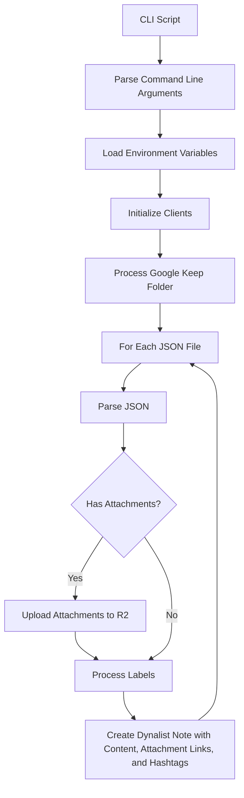

# Google Keep to Dynalist Migration Tool - Implementation Plan

## System Architecture



## Components and Implementation Details

### 1. Command Line Interface
- Use the standard Go `flag` package to parse command-line arguments
- Accept a required argument for the Google Keep takeout folder path
- Validate that the provided path exists and is a directory

### 2. Google Keep Note Parser
- Create a struct to represent Google Keep notes based on the JSON structure
- Implement a function to read and parse JSON files from the takeout folder
- Handle different note types (with/without attachments, with/without title/content)
- Extract and process labels from Google Keep notes

### 3. Attachment Handler
- Enhance the existing Cloudflare R2 client to handle local file uploads
- Implement a function to locate attachment files in the takeout folder
- Upload each attachment and collect the resulting URLs

### 4. Label Processing
- Convert Google Keep labels to Dynalist hashtags
- Format hashtags appropriately (e.g., convert spaces to underscores)
- Add hashtags at the end of the note content

### 5. Dynalist Integration
- Use the existing `AddToDynalist` function
- Format notes according to the specified format:
  - Title as the Dynalist item title
  - Content as the main text
  - Attachment links in the middle
  - Hashtags (converted from labels) at the end

### 6. Main Process Flow
- Initialize clients (Dynalist, Cloudflare R2)
- Walk through the Google Keep takeout folder
- Process each JSON file
- Handle errors gracefully with appropriate logging

### 7. Documentation and Docker Support
- Create a comprehensive README.md
- Implement GitHub Actions workflow for Docker image building
- Create a Dockerfile for containerization

## File Structure

```
gkeep2dynalist/
├── main.go             # Entry point, CLI handling
├── dynalist.go         # Dynalist API integration (existing)
├── cloudflare.go       # Cloudflare R2 integration (existing)
├── keepnote.go         # Google Keep note parsing
├── README.md           # Documentation
├── Dockerfile          # Docker configuration
├── .github/
│   └── workflows/
│       └── docker.yml  # GitHub Actions workflow
```

## Example Note Format

For a Google Keep note with:
- Title: "Meeting Notes"
- Content: "Discuss project timeline"
- Attachments: 2 images
- Labels: "Work", "Project A"

The resulting Dynalist note would be:
- Title: "Meeting Notes"
- Content: 
  ```
  Discuss project timeline
  
  Attachments:
  [Image 1](https://r2-url-1)
  [Image 2](https://r2-url-2)
  
  #Work #Project_A
  ```

## Implementation Steps

1. Create `keepnote.go` with Google Keep note structures and parsing functions
2. Update `cloudflare.go` to handle local file uploads
3. Update `main.go` with command-line argument parsing and the main processing loop
4. Create documentation and Docker support files
5. Test with sample Google Keep takeout data